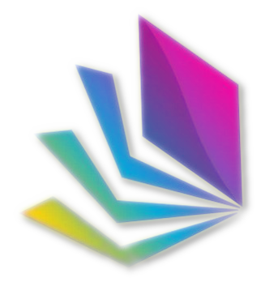

# Project Prism 
Project Prism is a comprehensive and scalable attendance tracking and class management application for educational institutions. With its versatile features and user-friendly interface, the app provides an efficient and easy-to-use solution for faculty, students, and parents alike.

## Features

Project Prism includes the following key features:

-    **Timetable tracking**: track timetables and make it easier to order the timetable virtually.
-    **Professor or student info listing**: list professor or student information for phone call or profile check.
-    **Leave and on-duty applications**: facilitate leave and on-duty applications for students.
-    **Built-in chat**: communicate with students or other teachers using the app's built-in chat feature.
-    **Announcement**: make announcements to your students or classes.
-    **Class performance monitoring**: monitor class performance using charts and graphs.
-    **Attendance tracking**: record attendance for individual students and view attendance reports for your classes.

**Note** : More features such as quizz, bus tracking [possibly], and other features are on working in process.

## **Getting Started**
## Prerequisites

To use Project Prism, you will need a device running one of the following operating systems:

-    Windows
-    macOS
-    Android
-    Ubuntu
-    iOS (jailbreak required, as of now)

## Installation

To install the app on your device, you can either build the executable file by yourself or use the below link for specific platform.

-   Android [APK] 
    -   Bundle :
    -   armv8 : https://github.com/EphemeralSapient/Project-Prism/raw/main/install/android/app-arm64-v8a-release.apk [Modern android phones]
    
    -   armv7 [ alias : armhf] : https://github.com/EphemeralSapient/Project-Prism/raw/main/install/android/app-armeabi-v7a-release.apk [Old android phones]
    -   x86_64 : https://github.com/EphemeralSapient/Project-Prism/raw/main/install/android/app-x86_64-release.apk [Intel based android phones]
    -   ??
-   Window [EXE] : 
-   MacOS [DMG]
    -   Intel :
    -   ARM :
-   Ubuntu/Debian
    -   appimage :
    -   deb :
-   iOS [IPA]
    - ipa :
    - **Note** : maybe in future I'll add this app on apple store? i dunno.

Website : https://ephemeralsapient.github.io/Project-Prism/

## Usage

You have the option to either create an account with your email address to access all the features of the app as a student or use the app as a guest without logging in. There are three types of accounts available:

-    Admin account: for professors or teachers, who can access all the features of the app and manage attendance and other information for their classes.
-    Student account: for students, who can view their attendance records, timetables, and other information related to their classes.
-    Guest account: for parents or outsiders, who can view basic information such as timetables and class schedules without logging in. Please note that guest data is not saved on the cloud.

This means that you can use the app without having to enter any login data if you choose to use the guest account feature. However, if you want to access more features or use the app as a student or teacher, you will need to create an account using your email address.

## Feedback and Support

Project Prism is a product of my passion for developing efficient and user-friendly solutions for educational institutions. I am solely responsible for managing and developing this project, and I understand that bugs and issues may arise during the development process.

If you have any feedback or suggestions for Project Prism, I would be delighted to hear from you. Additionally, if you experience any issues with the app, please don't hesitate to reach out to me for support. You can contact me via Discord or WhatsApp using the details below:

-   Discord : **semp#8221**
-   Whatsapp [Group] : https://chat.whatsapp.com/H8mB8fvTM0m83wnKRkNEsh

Thank you for your support and interest in Project Prism.

## Technologies Used

Project Prism is built using the following technologies:

-    **Flutter**: a mobile app SDK for building high-performance, high-fidelity, apps for iOS and Android, from a single codebase.
-    **Firebase**: a Backend as a Service (BaaS) provider, which provides a range of services, including cloud storage, authentication, and real-time database.

## License

Project Prism is licensed under the Creative Commons Attribution (CC BY) license. This means that you are free to use, distribute, and modify the app for any purpose, including commercial purposes, as long as you give attribution to me.
